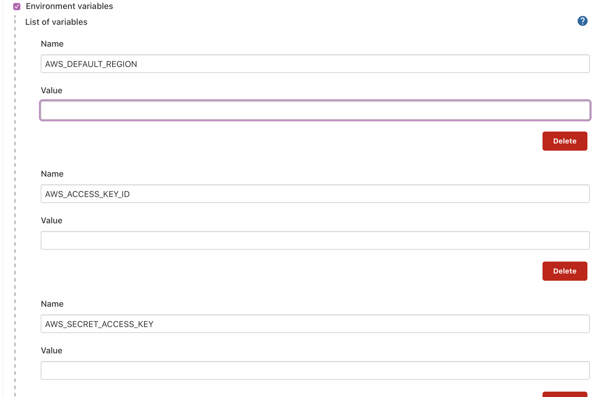
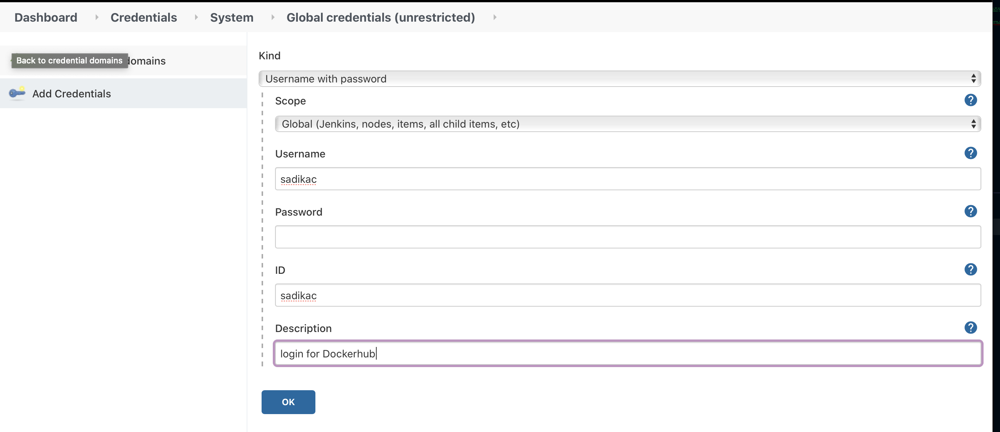
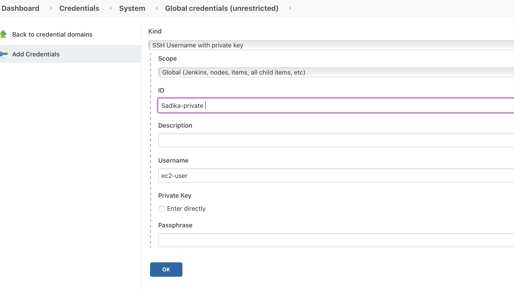
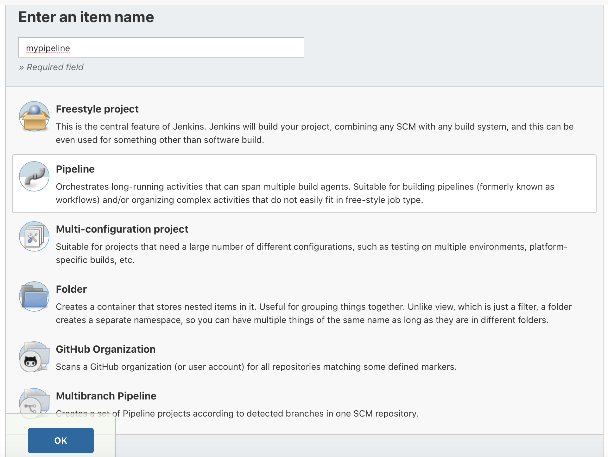
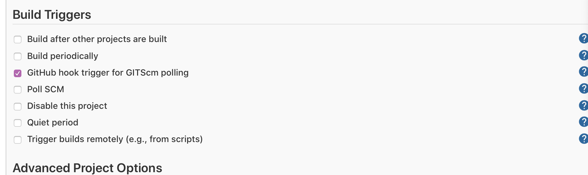
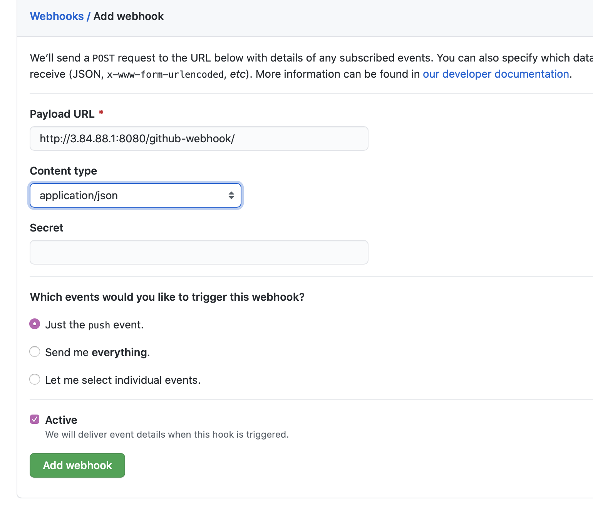
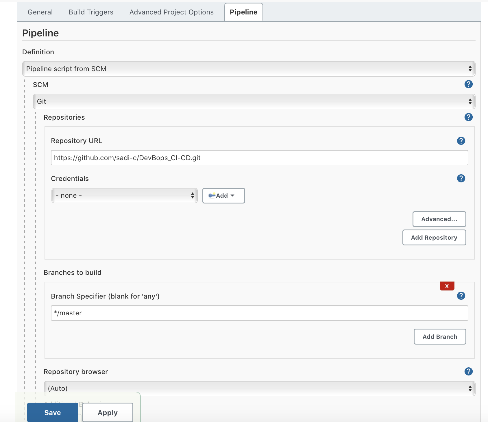

# Setting up CI/CD pipeline using Jenkins

> 1. Making sure you have a Jenkins server running in your public subnet.From the command line of your server running in the public subnet do the following commands:
* sudo yum install git -y
* sudo yum install python3 -y
* sudo amazon-linux-extras install docker -y
* sudo yum install docker
* sudo service docker start
* sudo systemctl enable docker
* sudo usermod -a -G docker jenkins

> 2. Access your Jenkins server from the web using the public IP at port 8080. From there install the follwing plugins for Jenkins server to do so go to manage Jenkins then manage plugins 
* Docker Commons Plugin
* Docker Pipeline
* Docker plugin
* docker-build-step
* CloudBees Docker Build and Publish plugin
* SSH Agent

> 3. My testing stage is depended on the boto3 SDK to access AWS services, in order for this test to pass I need to set up environmental variables so that my test can properly function. To do so go to go to Jenkins -> Manage Jenkins -> Configure System -> Global properties -> Environment variables
  
 

 
 
> 4. This pipeline also builds and pushes images to the dockerhub. In order to push to dockerhub in a secure manner we will provide our dockerhub credientials as Jenkins creditentials

  
 

 

> 5. Now we will create another EC2 instance in our private subnet so that it can ressemble our backend services. When setting up the EC2, you can use the commands from section 1 as a user data scripts that will install all the needed software and permission at boot time. It's also important to configure the security group of this ec2 to allow SSH access from our server in the public subnet using it's private IP address. 

 

> 6. Our Jenkins server uses the plugins ssh agent in order to push changes into our ec2 in the private subent. In order for this to happen we must provide credentials so that our Jenkins server can ssh into the respective server 

 
 

 

> We will also upload the PEM file by clicking the option private key enter directly and adding it.
 

> 7. Now we will create our pipeline 
 
 

 

> 8. Settign up build triggers and github webhook 
 
 

 

> According to Jenkins this option will "If Jenkins will receive PUSH GitHub hook from repo defined in Git SCM section it will trigger Git SCM polling logic. " 

 
 

 

> 9. We are configuring the pipline to look for Jenkins file within our git repo, this Jenkins file will define all the stages necessary.
 
 

 